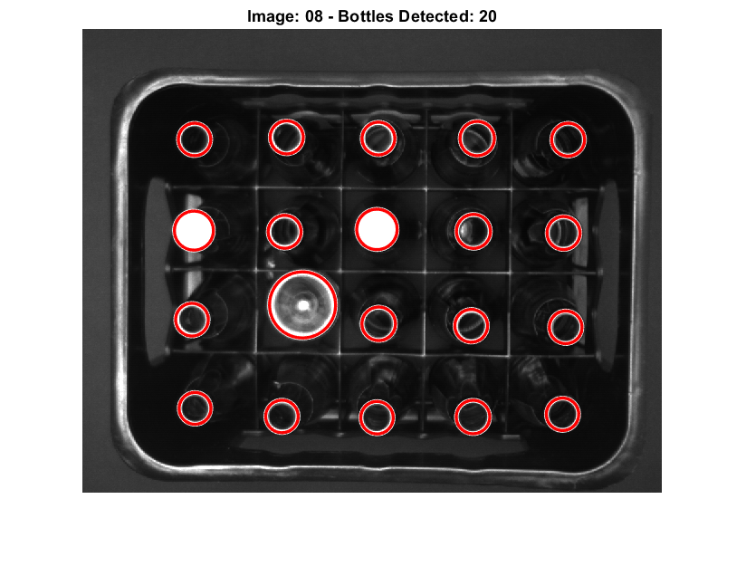
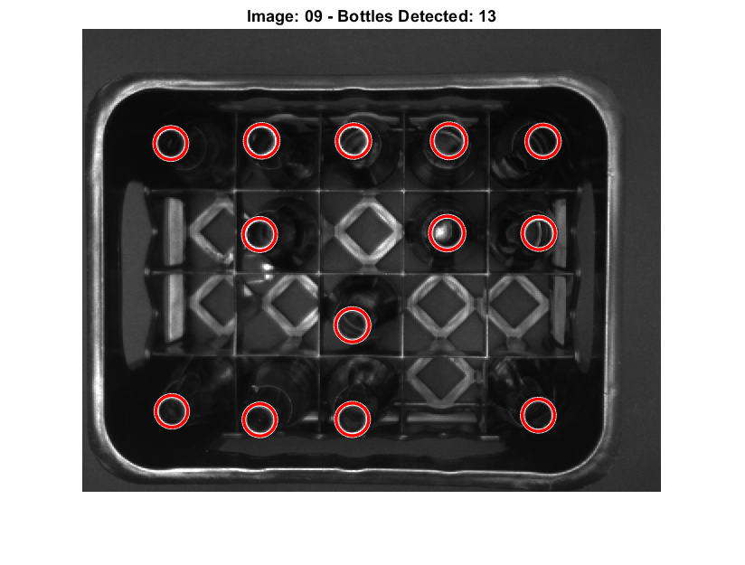
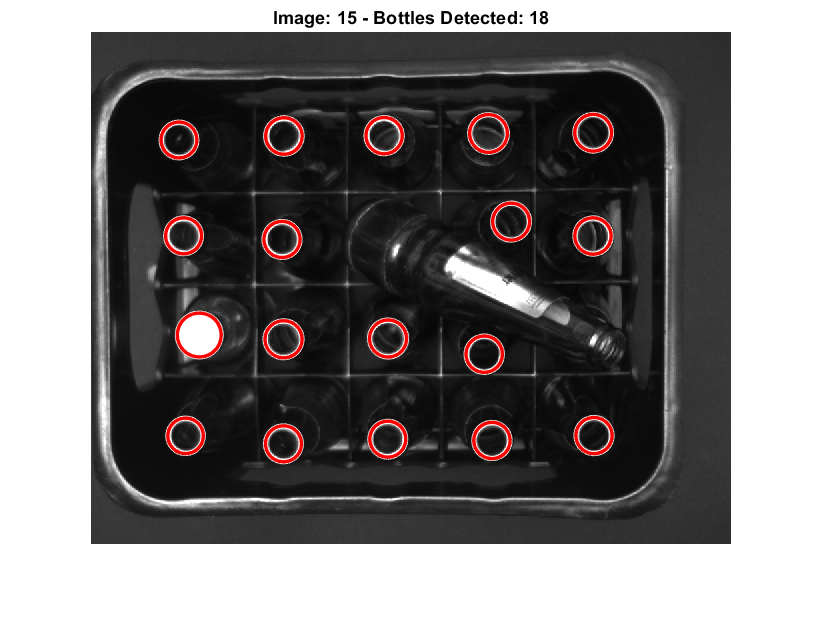
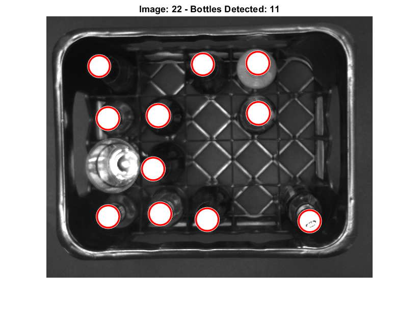

# Machine Vision: Bottle Detection with Hough Transform 🍾🔍

This MATLAB-based project demonstrates bottle detection in images. Developed as a final home assignment, it employs the Hough Transform technique to locate and count bottles with a series of preprocessing steps to enhance image quality.

## Features 🌟

- Preprocessing functions to improve image quality for detection.
- Hough Transform for robust circle detection representing bottles.
- Interactive results display with a figure showing detected bottles.

## Usage 🛠️

Execute the script in MATLAB to begin the detection process. Each image will be processed to detect bottles, and the results will be visualized and tabulated.

## Results 📊

The output includes a table comparing the detected number of bottles against true counts and an interactive visualization of each processed image.

### Example Images

| Image 8 | Image 9 | Image 15 | Image 22 |
|:-------:|:-------:|:-------:|:-------:|
|  |  |  |  |

## Course Information 🎓

This assignment was completed as part of the Machine Vision course under the PSRS 2023 program at the University of Eastern Finland (UEF), in collaboration with Peter Samaha.

## Acknowledgments 🙏

Special thanks to the instructors of the Machine Vision course.
